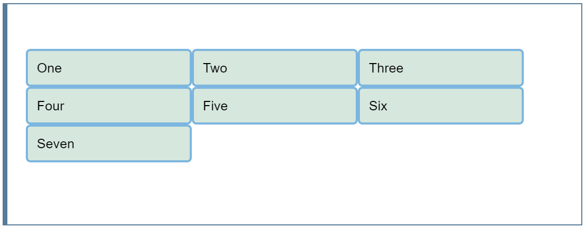
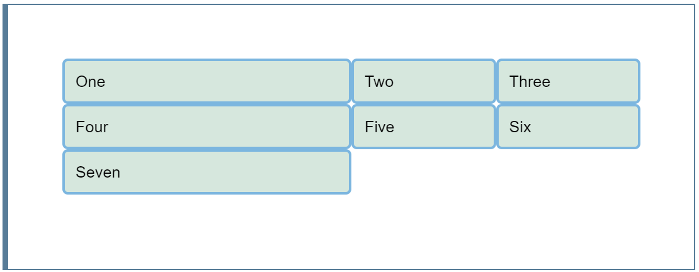
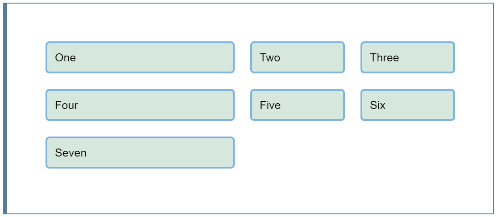
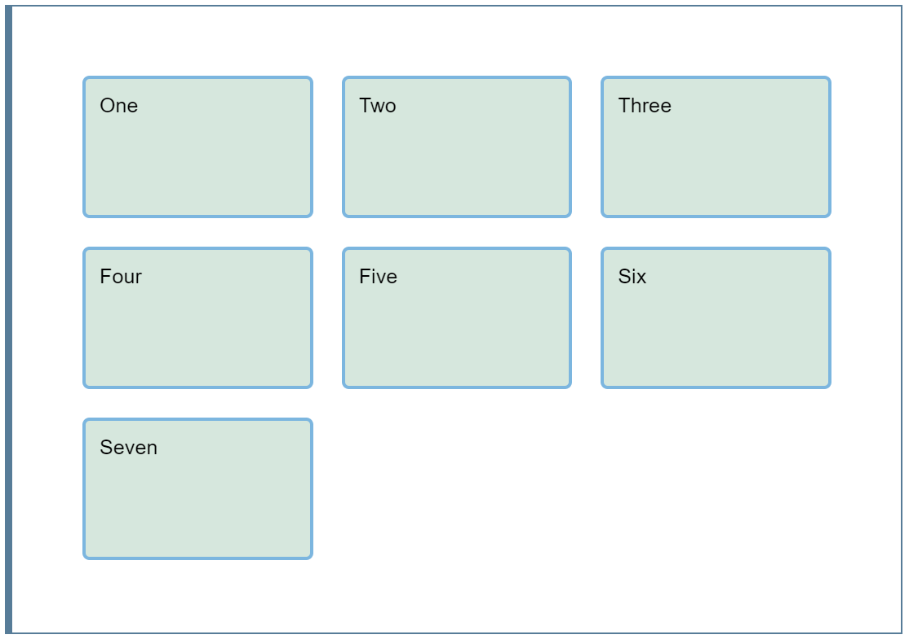
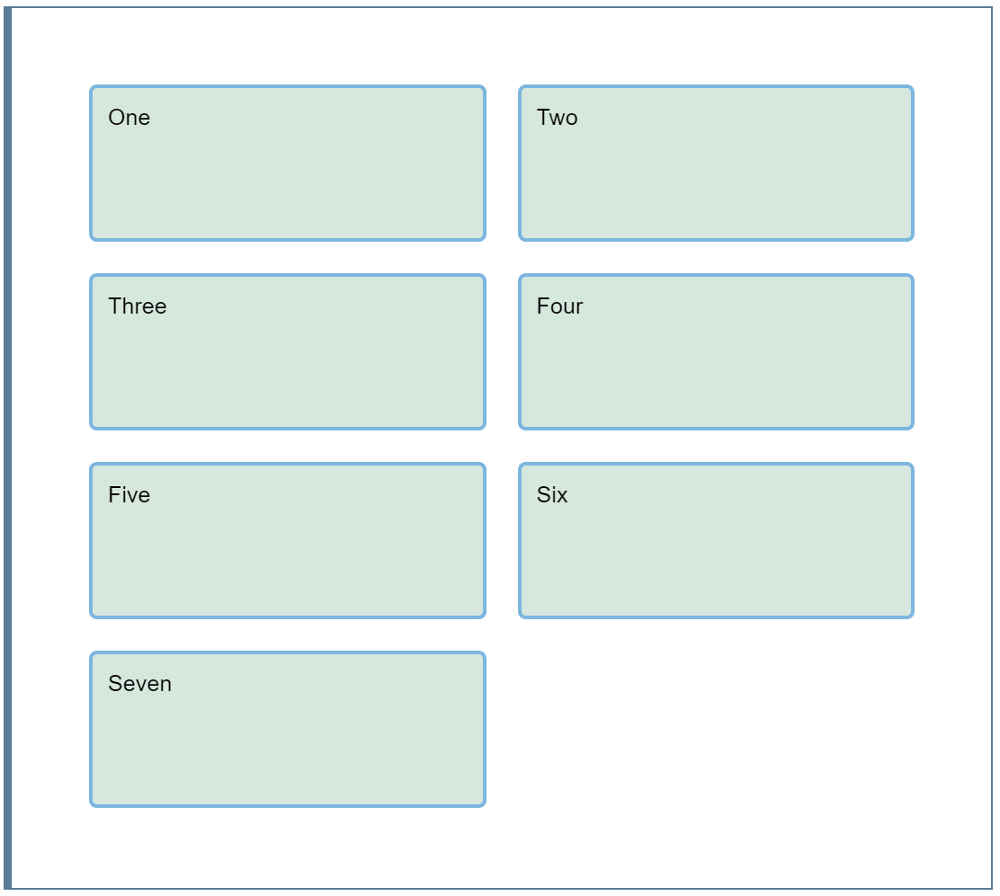
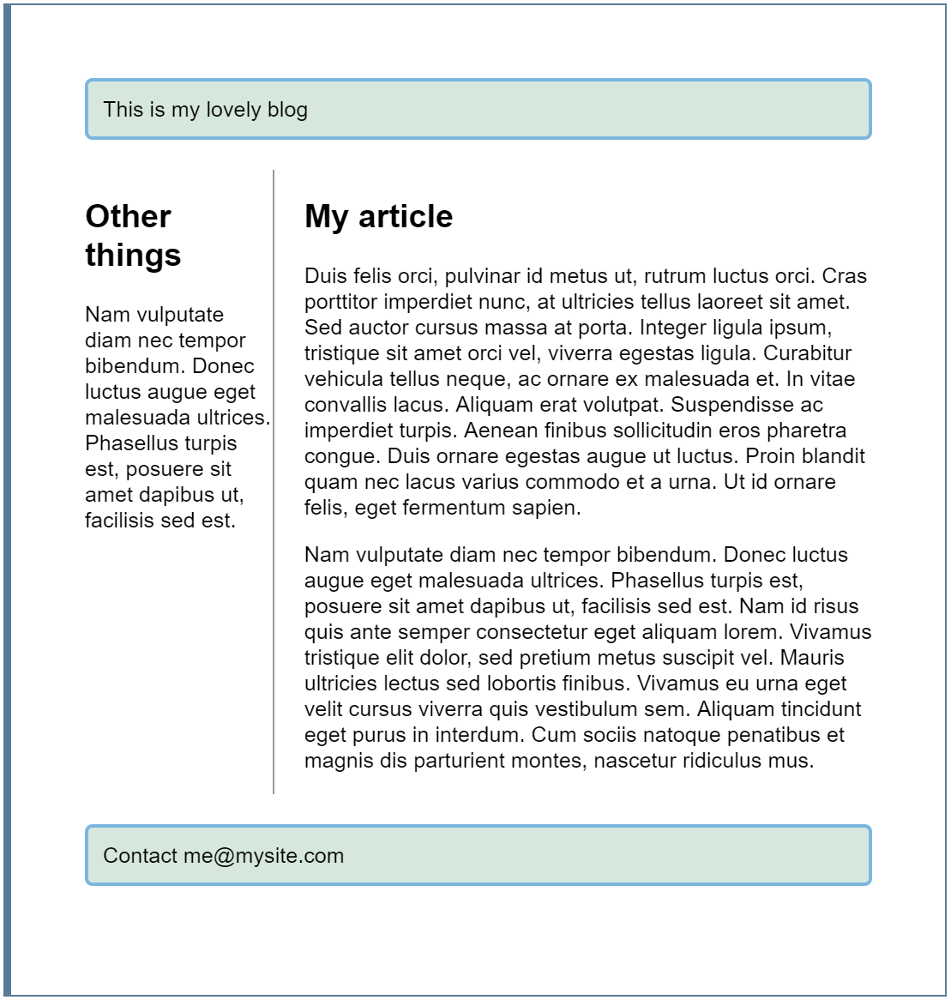
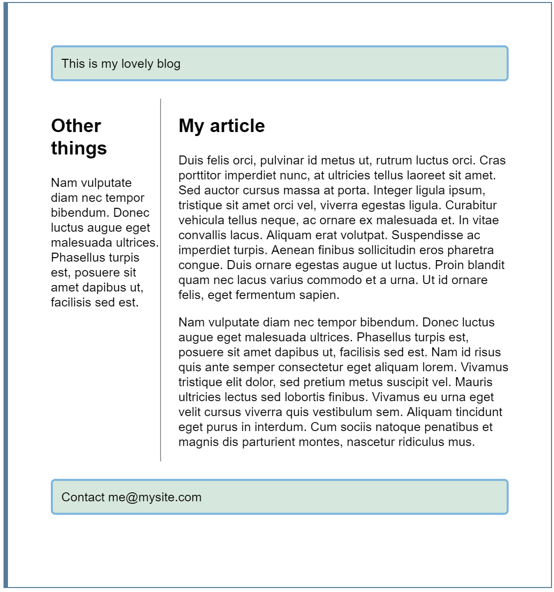
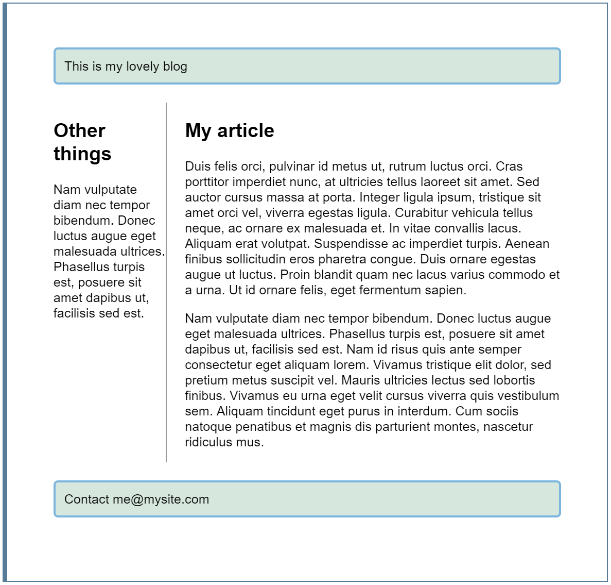
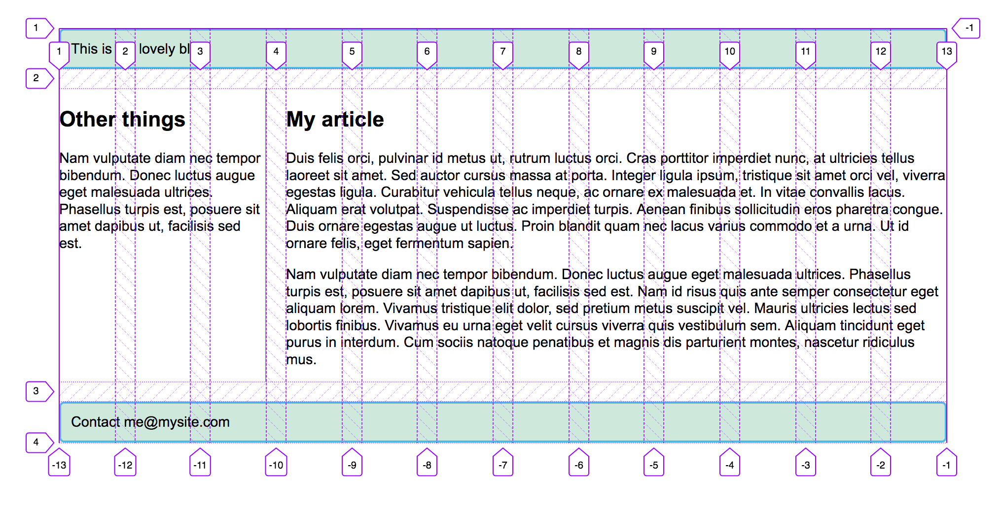

# CSS Grid Layout

CSS Grid Layout is a two-dimensional layout system for the web. It lets you lay content out in rows and columns, and has many features that make building complex layouts straightforward. This article will give you all you need to know to get started with page layout.

## What is grid layout

A grid is simply a collection of horizontal and vertical lines creating a pattern against which we can line up our design elements. They help us to create designs where elements don’t jump around or change width as we move from page to page, providing greater consistency on our websites.

A grid will typically have **columns**, **rows**, and then gaps between each row and column — commonly referred to as **gutters**.


## Creating your grid in CSS

Having decided on the grid that your design needs, you can use CSS Grid Layout to create that grid in CSS and place items onto it. We will look at the basic features of Grid Layout first and then explore how to create a simple grid system for your project.

### Defining a grid

As a starting point, download and open the [starting point](https://github.com/mdn/learning-area/blob/master/css/css-layout/grids/0-starting-point.html) file in your text editor and browser (you can also [see it live](https://mdn.github.io/learning-area/css/css-layout/grids/0-starting-point.html) here). You will see an example with a container, which has some child items. By default these display in normal flow so the boxes display one below the other. We will be working with this file for the first part of this lesson, making changes to see how grid behaves.

To define a grid we use the `grid` value of the `display` property. As with Flexbox, this switches on Grid Layout, and all of the direct children of the container become grid items. Add this to the CSS inside your file:

```css
.container {
    display: grid;
}
```

Unlike flexbox, the items will not immediately look any different. Declaring `display: grid` gives you a one column grid, so your items will continue to display one below the other as they do in normal flow.

To see something that looks more grid-like, we will need to add some columns to the grid. Let's add three 200-pixel columns here. You can use any length unit, or percentages to create these column tracks.

```css
.container {
    display: grid;
    grid-template-columns: 200px 200px 200px;
}
```

Add the 2nd declaration to your CSS rule, then reload the page, and you should see that the items have rearranged themselves one into each cell of the created grid.



### Flexible grids with the fr unit

In addition to creating grids using lengths and percentages, we can use the `fr` unit to flexibly size grid rows and columns. This unit represents one fraction of the available space in the grid container.

Change your track listing to the following definition, creating three `1fr` tracks.

```css
.container {
    display: grid;
    grid-template-columns: 1fr 1fr 1fr;
}
```

You should now see that you have flexible tracks. The `fr` unit distributes space in proportion, therefore you can give different positive values to your tracks, for example if you change the definition like so:

```css
.container {
    display: grid;
    grid-template-columns: 2fr 1fr 1fr;
}
```

The first track now gets `2fr` of the available space and the other two tracks get `1fr`, making the first track larger. You can mix `fr` units and fixed length tracks — in such a case the space needed for the fixed tracks is taken away before the space is distributed to the other tracks.




The fr unit distributes available space, not all space. Therefore if one of your tracks has something large inside it there will be less free space to share out.


### Gaps between tracks

To create gaps between tracks we use the properties `grid-column-gap` for gaps between columns, `grid-row-gap` for gaps between rows, and `grid-gap` to set both at once.

```css
.container {
    display: grid;
    grid-template-columns: 2fr 1fr 1fr;
    grid-gap: 20px;
}
```

These gaps can be any length unit or a percentage, but not an `fr` unit.



### Repeating track listings

You can repeat all, or a section of, your track listing using repeat notation. Change your track listing to the following:

```css
.container {
    display: grid;
    grid-template-columns: repeat(3, 1fr);
    grid-gap: 20px;
}
```

You will now get 3 `1fr` tracks just as before. The first value passed to the repeat function is how many times you want the listing to repeat, while the second value is a track listing, which may be one or more tracks that you want to repeat.

### The implicit and explicit grid

We have only specified column tracks so far, and yet rows are being created to hold our content. This is an example of the explicit versus the implicit grid. The explicit grid is the one that you create using `grid-template-columns` or `grid-template-rows`. The implicit grid is created when content is placed outside of that grid — such as into our rows. The explicit and implicit grids are analagous to the main and cross flexbox axes.

By default, tracks created in the implicit grid are auto sized, which in general means that they are large enough to fit their content. If you wish to give the tracks the browser creates a size you can use the `grid-auto-rows` and `grid-auto-columns` properties. If you add `grid-auto-rows` with a value of `100px` to your CSS, you will see that those created rows are now 100 pixels tall.

```css
.container {
  display: grid;
  grid-template-columns: repeat(3, 1fr);
  grid-auto-rows: 100px;
  grid-gap: 20px;
}
```



### The `minmax()` function

Our 100-pixel tall tracks won’t be very useful if we add content into those tracks that is taller than 100 pixels, in which case it would cause an overflow. It might be better to have tracks that are _at least_ 100 pixels tall and can still expand if more content gets into them. A fairly basic fact about the web is that you never really know how tall something is going to be; additional content or larger font sizes can cause problems with designs that attempt to be pixel perfect in every dimension.

The `minmax` function lets us set a minimum and maximum size for a track, for example `minmax(100px, auto)`. The minimum size is 100 pixels, but the maximum is auto, which will expand to fit the content. Try changing `grid-auto-rows` to use a minmax value:

```css
.container {
    display: grid;
    grid-template-columns: repeat(3, 1fr);
    grid-auto-rows: minmax(100px, auto);
    grid-gap: 20px;
}
```

If you add extra content you will see that the track expands to allow it to fit. Note that the expansion happens right along the row.

### As many columns as will fit

We can combine some of the things we have learned about track listing, repeat notation and `minmax()` to create a useful pattern. Sometimes it is helpful to be able to ask grid to create as many columns as will fit into the container. We do this by setting the value of `grid-template-columns` using `repeat()` notation, but instead of passing in a number, pass in the keyword `auto-fill`. For the second parameter of the function we use `minmax()`, with a minimum value equal to the minimum track size that we would like to have, and a maximum of `1fr`.

Try this in your file now, using the below CSS:

```css
.container {
  display: grid;
  grid-template-columns: repeat(auto-fill, minmax(200px, 1fr));
  grid-auto-rows: minmax(100px, auto);
  grid-gap: 20px;
}
```



This works because grid is creating as many 200 pixel columns as will fit into the container, then sharing whatever space is leftover between all of the columns — the maximum is 1fr which, as we already know, distributes space evenly between tracks.

## Line-based placement

We now move on from creating a grid, to placing things on the grid. Our grid always has lines, these lines start at 1 and relate to the Writing Mode of the document. Therefore in English, column line 1 is on the left hand side of the grid and row line 1 at the top. In Arabic column line 1 would be on the righthand side, as Arabic is written right to left.

We can place things according to these lines by specifying the start and end line. We do this using the following properties:

* `grid-column-start`
* `grid-column-end`
* `grid-row-start`
* `grid-row-end`
  
These properties can all have a line number as the value. You can also use the shorthand properties:

* `grid-column`
* `grid-row`

These let you specify the start and end lines at once, separated by a / — a forward slash character.

[Download this file as a starting point](https://github.com/mdn/learning-area/blob/master/css/css-layout/grids/8-placement-starting-point.html) or [see it live here](https://mdn.github.io/learning-area/css/css-layout/grids/8-placement-starting-point.html). It has a grid defined already, and a simple article outlined. You can see that auto-placement is placing items one into each cell of the grid that we have created.

We will instead place all of the elements for our site on the grid, using the grid lines. Add the following rules to the bottom of your CSS:

```css
header {
  grid-column: 1 / 3;
  grid-row: 1;
}

article {
  grid-column: 2;
  grid-row: 2;
}

aside {
  grid-column: 1;
  grid-row: 2;
}

footer {
  grid-column: 1 / 3;
  grid-row: 3;
}
```



## Positioning with grid-template-areas

An alternative way to place items on your grid is to use the `grid-template-areas` property and giving the various elements of your design a name.

Remove the line-based positioning from the last example (or re-download the file to have a fresh starting point), and add the following CSS.

```css
.container {
  display: grid;
  grid-template-areas:
      "header header"
      "sidebar content"
      "footer footer";
  grid-template-columns: 1fr 3fr;
  grid-gap: 20px;
}

header {
  grid-area: header;
}

article {
  grid-area: content;
}

aside {
  grid-area: sidebar;
}

footer {
  grid-area: footer;
}
```

Reload the page and you will see that your items have been placed just as before without us needing to use any line numbers!



The rules for `grid-template-areas` are as follows:

* You need to have every cell of the grid filled.
* To span across two cells, repeat the name.
* To leave a cell empty, use a `.` (period).
* Areas must be rectangular — you can’t have an L-shaped area for example.
* Areas can't be repeated in different locations.

You can play around with our layout, changing the footer to only sit underneath the content and the sidebar to span all the way down for example. This is a very nice way to describe a layout as it is obvious from the CSS exactly what is happening.

## A CSS Grid, grid framework

Grid "frameworks" tend to be based around 12 or 16 column grids and with CSS Grid, you don’t need any third party tool to give you such a framework — it's already there in the spec.

[Download the starting point file](https://github.com/mdn/learning-area/blob/master/css/css-layout/grids/11-grid-system-starting-point.html). This contains a container with a 12 column grid defined, and the same markup as we used in the previous two examples. We can now use line-based placement to place our content on the 12 column grid.

```css
header {
  grid-column: 1 / 13;
  grid-row: 1;
}

article {
  grid-column: 4 / 13;
  grid-row: 2;
}

aside {
  grid-column: 1 / 4;
  grid-row: 2;
}

footer {
  grid-column: 1 / 13;
  grid-row: 3;
}
```



If you use the [Firefox Grid Inspector](https://developer.mozilla.org/en-US/docs/Tools/Page_Inspector/How_to/Examine_grid_layouts) to overlay the grid lines on your design, you can see how our 12 column grid works.



You can also use a Grid Inspector in [Chorme](https://developers.google.com/web/updates/2017/08/devtools-release-notes#css-grid-highlighting).

<YoutubeVideo video-id="AqwPrR7hklE>

## Summary

In this overview we have toured the main features of CSS Grid Layout. You should be able to start using it in your designs. To dig further into the specification, read our guides to Grid Layout, which can be found below.

## Extra

* <https://developer.mozilla.org/en-US/docs/Learn/CSS/CSS_layout/Grids>
* <https://www.w3schools.com/css/css_grid.asp>
