# Webpage Layout

CSS page layout techniques allow us to take elements contained in a web page and control where they are positioned relative to their default position in normal layout flow, the other elements around them, their parent container, or the main viewport/window.  The page layout techniques we'll be covering in more detail in this module are

* Normal flow
* The `display` property
* Flexbox
* Grid
* Floats
* Positioning
* Table layout
* Multiple-column layout

Each technique has its uses, advantages, and disadvantages, and no technique is designed to be used in isolation. By understanding what each method is designed for you will be in a good place to understand which is the best layout tool for each task.

## Normal flow

Normal flow is how the browser lays out HTML pages by default when you do nothing to control page layout. Let's look at a quick HTML example:

```html
<p>I love my cat.</p>

<ul>
  <li>Buy cat food</li>
  <li>Exercise</li>
  <li>Cheer up friend</li>
</ul>

<p>The end!</p>
```

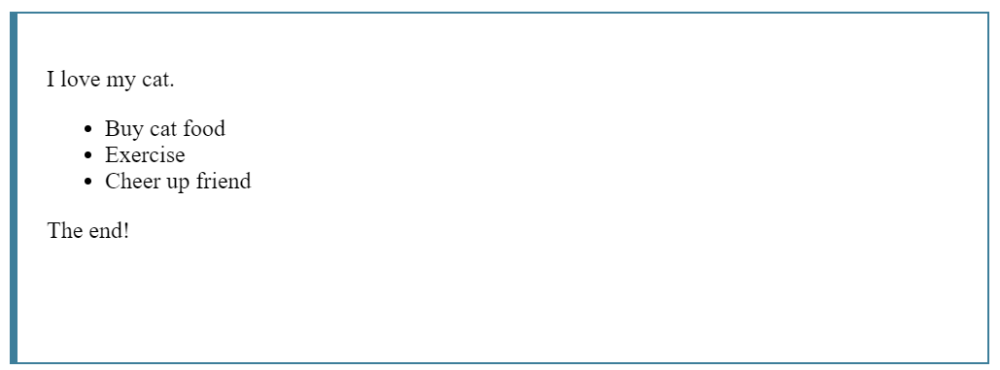

Note here how the HTML is displayed in the exact order in which it appears in the source code, with elements stacked up on top of one another — the first paragraph, followed by the unordered list, followed by the second paragraph.

The elements that appear one below the other are described as *block* elements, in contrast to *inline* elements, which appear one beside the other, like the individual words in a paragraph.

When you use CSS to create a layout, what you are doing is moving the elements away from this normal flow, however for many of the elements on your page this normal flow will create exactly the layout you need. This is why starting with a well-structured HTML document is so important, as you can then work with the way things are laid out by default rather than fighting against it.

The methods that can change how elements are laid out in CSS are as follows:

* **The `display` property** — Standard values such as `block`, `inline` or `inline-block` can change how elements behave in normal flow. We then have entire layout methods that are switched on via a value of `display`, for example CSS Grid and Flexbox.
* **Floats** — Applying a `float` value such as `left` can cause block level elements to wrap alongside one side of an element, like the way images sometimes have text floating around them in magazine layouts.
* **The `position` property** — Allows you to precisely control the placement of boxes inside other boxes. `static` positioning is the default in normal flow, but you can cause elements to be laid out differently using other values, for example always fixed to the top left of the browser viewport.
* **Table layout** — features designed for styling the parts of an HTML table can be used on non-table elements using `display: table` and associated properties..
* **Multi-column layout** — The Multi-column layout properties can cause the content of a block to layout in columns, as you might see in a newspaper.

## The display property

The main methods of achieving page layout in CSS are all values of the `display` property. This property allows us to change the default way something displays. Everything in normal flow has a value of `display`, used as the default way that elements they are set on behave. For example, the fact that paragraphs in English display one below the other is due to the fact that they are styled with `display: block`. If you create a link around some text inside a paragraph, that link remains inline with the rest of the text, and doesn’t break onto a new line. This is because the `<a>` element is `display: inline` by default.

You can change this default display behaviour. For example, the `<li>` element is display: block by default, meaning that list items display one below the other in our English document. If we change the display value to `inline` they now display next to each other, as words would do in a sentence. The fact that you can change the value of `display` for any element means that you can pick HTML elements for their semantic meaning, without being concerned about how they will look. The way they look is something that you can change.

In addition to being able to change the default presentation by turning an item from `block` to `inline` and vice versa, there are some bigger layout methods that start out as a value of `display`. However when using these you will generally need to invoke additional properties. The two values most important for our purposes when discussing layout are `display: flex` and `display: grid`.

## Flexbox

Flexbox is the short name for the Flexible Box Layout Module, designed to make it easy for us to lay things out in one dimension — either as a row or as a column. To use flexbox, you apply `display: flex` to the parent element of the elements you want to lay out; all its direct children then become flex items. We can see this in a simple example.

The HTML markup below gives us a containing element, with a class of `wrapper`, inside which are three `<div>` elements. By default these would display as block elements, below one another, in our English language document.

However, if we add `display: flex` to the parent, the three items now arrange themselves into columns. This is due to them becoming flex items and using some initial values that flexbox gives them. They are displayed as a row, because the initial value of `flex-direction` is `row`. They all appear to stretch to the height of the tallest item, because the initial value of the `align-items` property is `stretch`. This means that the items stretch to the height of the flex container, which in this case is defined by the tallest item. The items all line up at the start of the container, leaving any extra space at the end of the row.

```css
.wrapper {
  display: flex;
}
```

```html
<div class="wrapper">
  <div class="box1">One</div>
  <div class="box2">Two</div>
  <div class="box3">Three</div>
</div>
```

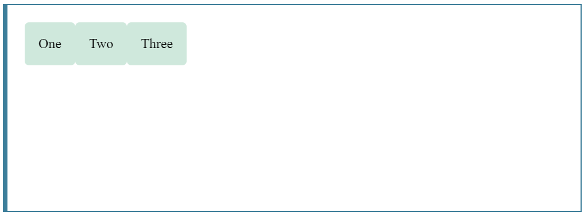

In addition to the above properties that can be applied to the flex container, there are properties that can be applied to the flex items. These properties, among other things, can change the way that the items flex, enabling them to expand and contract to fit into the available space.

As a simple example of this, we can add the `flex` property to all of our child items, with a value of `1`. This will cause all of the items to grow and fill the container, rather than leaving space at the end. If there is more space then the items will become wider; if there is less space they will become narrower. In addition, if you add another element to the markup the items will all become smaller to make space for it — they will adjust size to take up the same amount of space, whatever that is.

```css
.wrapper {
    display: flex;
}

.wrapper > div {
    flex: 1;
}
```

```html
<div class="wrapper">
    <div class="box1">One</div>
    <div class="box2">Two</div>
    <div class="box3">Three</div>
</div>
```

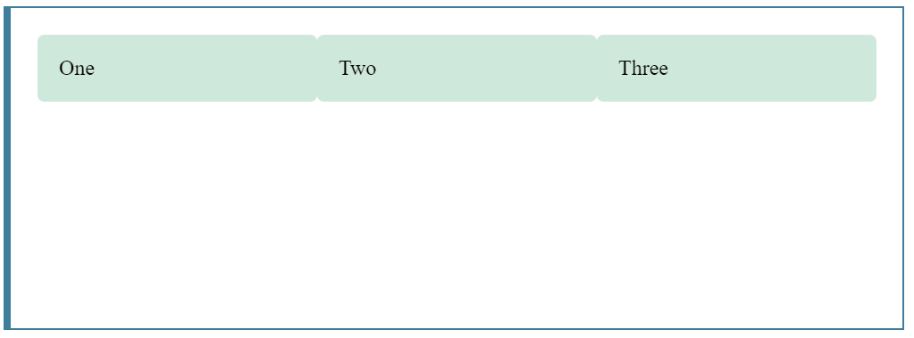

## Grid Layout

While flexbox is designed for one-dimensional layout, Grid Layout is designed for two dimensions — lining things up in rows and columns.

Once again, you can switch on Grid Layout with a specific value of display — `display: grid`. The below example uses similar markup to the flex example, with a container and some child elements. In addition to using `display: grid`, we are also defining some row and column tracks on the parent using the `grid-template-rows` and `grid-template-columns` properties respectively. We've defined three columns each of `1fr` and two rows of `100px`. I don’t need to put any rules on the child elements; they are automatically placed into the cells our grid has created.

```css
.wrapper {
    display: grid;
    grid-template-columns: 1fr 1fr 1fr;
    grid-template-rows: 100px 100px;
    grid-gap: 10px;
}
```

```html
<div class="wrapper">
    <div class="box1">One</div>
    <div class="box2">Two</div>
    <div class="box3">Three</div>
    <div class="box4">Four</div>
    <div class="box5">Five</div>
    <div class="box6">Six</div>
</div>
```

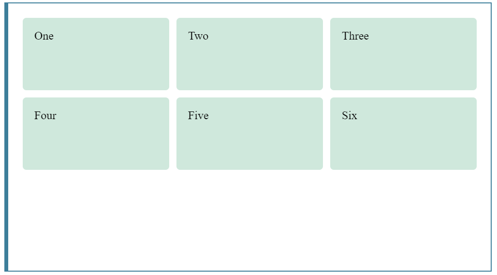

Once you have a grid, you can explicitly place your items on it, rather than relying on the auto-placement behavior seen above. In the second example below we have defined the same grid, but this time with three child items. We've set the start and end line of each item using the `grid-column` and `grid-row` properties. This causes the items to span multiple tracks.

```css
.wrapper {
    display: grid;
    grid-template-columns: 1fr 1fr 1fr;
    grid-template-rows: 100px 100px;
    grid-gap: 10px;
}

.box1 {
    grid-column: 2 / 4;
    grid-row: 1;
}

.box2 {
    grid-column: 1;
    grid-row: 1 / 3;
}

.box3 {
    grid-row: 2;
    grid-column: 3;
}
```

```html
<div class="wrapper">
    <div class="box1">One</div>
    <div class="box2">Two</div>
    <div class="box3">Three</div>
</div>
```

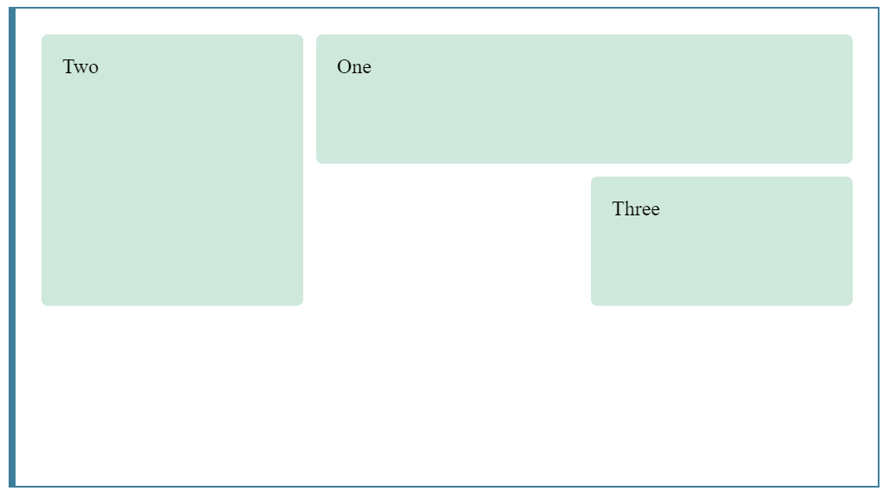

The rest of this guide covers other layout methods, which are less important for the main layout structures of your page but can still help you achieve specific tasks. By understanding the nature of each layout task, you will soon find that when you look at a particular component of your design the type of layout best suited to it will often be clear.

## Floats

Floating an element changes the behavior of that element and the block level elements that follow it in normal flow. The element is moved to the left or right and removed from normal flow, and the surrounding content floats around the floated item.

The `float` property has four possible values:

* `left` — Floats the element to the left.
* `right` — Floats the element to the right.
* `none` — Specifies no floating at all. This is the default value.
* `inherit` — Specifies that the value of the `float` property should be inherited from the element's parent element.

In the example below we float a `<div>` left, and give it a `margin` on the right to push the text away from the element. This gives us the effect of text wrapped around that box, and is most of what you need to know about floats as used in modern web design.

```html
<h1>Simple float example</h1>

<div class="box">Float</div>

<p> Lorem ipsum dolor sit amet, consectetur adipiscing elit. Nulla luctus aliquam dolor, eu lacinia lorem placerat vulputate. Duis felis orci, pulvinar id metus ut, rutrum luctus orci. Cras porttitor imperdiet nunc, at ultricies tellus laoreet sit amet. Sed auctor cursus massa at porta. Integer ligula ipsum, tristique sit amet orci vel, viverra egestas ligula. Curabitur vehicula tellus neque, ac ornare ex malesuada et. In vitae convallis lacus. Aliquam erat volutpat. Suspendisse ac imperdiet turpis. Aenean finibus sollicitudin eros pharetra congue. Duis ornare egestas augue ut luctus. Proin blandit quam nec lacus varius commodo et a urna. Ut id ornare felis, eget fermentum sapien.</p>
```

```css
.box {
    float: left;
    width: 150px;
    height: 150px;
    margin-right: 30px;
}
```

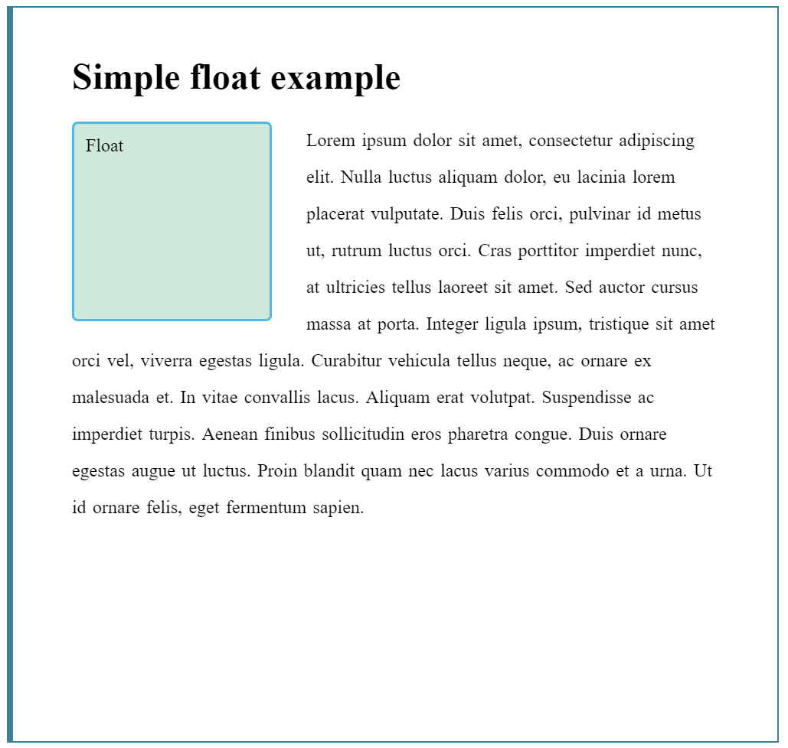

## Positioning techniques

Positioning allows you to move an element from where it would be placed when in normal flow to another location. Positioning isn’t a method for creating your main page layouts, it is more about managing and fine-tuning the position of specific items on the page.

There are however useful techniques for certain layout patterns that rely on the `position` property. Understanding positioning also helps in understanding normal flow, and what it is to move an item out of normal flow.

There are five types of positioning you should know about:

* **Static positioning** is the default that every element gets — it just means "put the element into its normal position in the document layout flow — nothing special to see here".
* **Relative positioning** allows you to modify an element's position on the page, moving it relative to its position in normal flow — including making it overlap other elements on the page.
* **Absolute positioning** moves an element completely out of the page's normal layout flow, like it is sitting on its own separate layer. From there, you can fix it in a position relative to the edges of the page's `<html>` element (or its nearest positioned ancestor element). This is useful for creating complex layout effects such as tabbed boxes where different content panels sit on top of one another and are shown and hidden as desired, or information panels that sit off screen by default, but can be made to slide on screen using a control button.
* **Fixed positioning** is very similar to absolute positioning, except that it fixes an element relative to the browser viewport, not another element. This is useful for creating effects such as a persistent navigation menu that always stays in the same place on the screen as the rest of the content scrolls.
* *Sticky positioning* is a newer positioning method which makes an element act like `position: static` until it hits a defined offset from the viewport, at which point it acts like `position: fixed`.

### Simple positioning example

To provide familiarity with these page layout techniques, we'll show you a couple of quick examples. Our examples will all feature the same HTML, which is as follows:

```html
<h1>Positioning</h1>

<p>I am a basic block level element.</p>
<p class="positioned">I am a basic block level element.</p>
<p>I am a basic block level element.</p>
```

This HTML will be styled by default using the following CSS:

```css
body {
  width: 500px;
  margin: 0 auto;
}

p {
    background-color: rgb(207,232,220);
    border: 2px solid rgb(79,185,227);
    padding: 10px;
    margin: 10px;
    border-radius: 5px;
}
```

The rendered output is as follows:

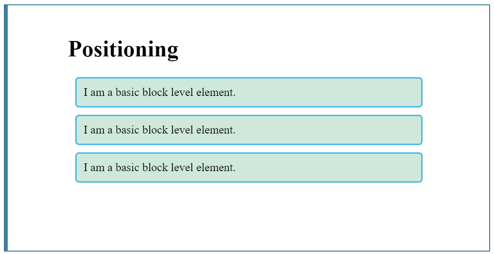

### Relative positioning

Relative positioning allows you to offset an item from the position in normal flow it would have by default. This means you could achieve a task such as moving an icon down a bit so it lines up with a text label. To do this, we could add the following rule to add relative positioning:

```css
.positioned {
  position: relative;
  top: 30px;
  left: 30px;
}
```

Here we give our middle paragraph a `position` value of `relative` — this doesn't do anything on its own, so we also add `top` and `left` properties. These serve to move the affected element down and to the right — this might seem like the opposite of what you were expecting, but you need to think of it as the element being pushed on its left and top sides, which result in it moving right and down.

Adding this code will give the following result:

```css
.positioned {
  position: relative;
  background: rgba(255,84,104,.3);
  border: 2px solid rgb(255,84,104);
  top: 30px;
  left: 30px;
}
```

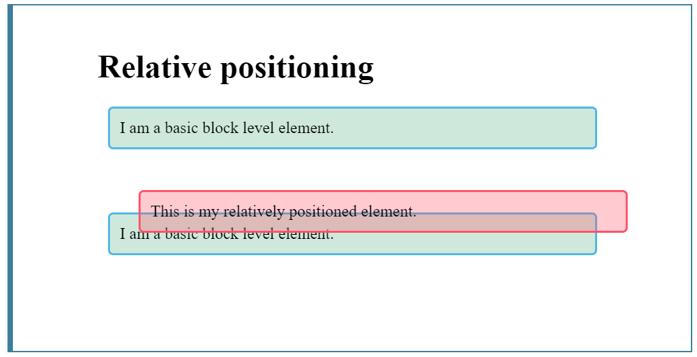

### Absolute positioning

Absolute positioning is used to completely remove an element from normal flow, and place it using offsets from the edges of a containing block.

Going back to our original non-positioned example, we could add the following CSS rule to implement absolute positioning:

```css
.positioned {
  position: absolute;
  top: 30px;
  left: 30px;
}
```

Here we give our middle paragraph a `position` value of `absolute`, and the same `top` and `left` properties as before. Adding this code, however, will give the following result:

```css
.positioned {
    position: absolute;
    background: rgba(255,84,104,.3);
    border: 2px solid rgb(255,84,104);
    top: 30px;
    left: 30px;
}
```

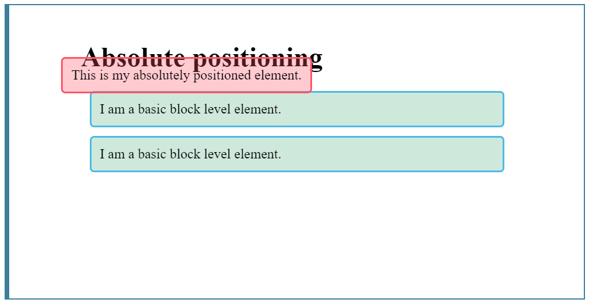

This is very different! The positioned element has now been completely separated from the rest of the page layout and sits over the top of it. The other two paragraphs now sit together as if their positioned sibling doesn't exist. The `top` and `left` properties have a different effect on absolutely positioned elements than they do on relatively positioned elements. In this case the offsets have been calculated from the top and left of the page. It is possible to change the parent element that becomes this container and we will take a look at that in the lesson on positioning.

### Fixed positioning

Fixed positioning removes our element from document flow in the same way as absolute positioning. However, instead of the offsets being applied from the container, they are applied from the viewport. As the item remains fixed in relation to the viewport we can create effects such as a menu which remains fixed as the page scrolls beneath it.

For this example our HTML is three paragraphs of text, in order that we can cause the page to scroll, and a box to which we will give `position: fixed`.

```html
<h1>Fixed positioning</h1>

<div class="positioned">Fixed</div>

<p>Paragraph 1.</p>
<p>Paragraph 2.</p>
<p>Paragraph 3.</p>
```

```css
.positioned {
    position: fixed;
    top: 30px;
    left: 30px;
}
```

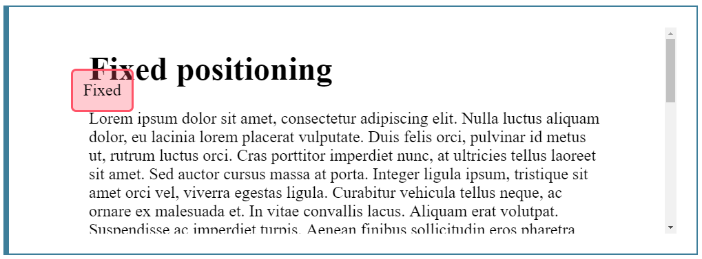

## Sticky positioning

Sticky positioning is the final positioning method that we have at our disposal. It mixes the default static positioning with fixed positioning. When an item has `position: sticky` it will scroll in normal flow until it hits offsets from the viewport that we have defined. At that point it becomes "stuck" as if it had `position: fixed` applied.

```css
.positioned {
  position: sticky;
  top: 30px;
  left: 30px;
}
```

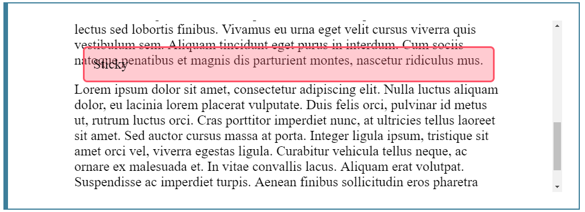

## Table layout

HTML tables are fine for displaying tabular data, but many years ago — before even basic CSS was supported reliably across browsers — web developers used to also use tables for entire web page layouts — putting their headers, footers, different columns, etc. in various table rows and columns. This worked at the time, but it has many problems — table layouts are inflexible, very heavy on markup, difficult to debug, and semantically wrong (e.g., screen reader users have problems navigating table layouts).

The way that a table looks on a webpage when you use table markup is due to a set of CSS properties that define table layout. These properties can be used to lay out elements that are not tables, a use which is sometimes described as "using CSS tables".

The example below shows one such use; using CSS tables for layout should be considered a legacy method at this point, for those situations where you have very old browsers without support for Flexbox or Grid.

Let's look at an example. First, some simple markup that creates an HTML form. Each input element has a label, and we've also included a caption inside a paragraph. Each label/input pair is wrapped in a `<div>`, for layout purposes.

```html
<form>
  <p>First of all, tell us your name and age.</p>
  <div>
    <label for="fname">First name:</label>
    <input type="text" id="fname">
  </div>
  <div>
    <label for="lname">Last name:</label>
    <input type="text" id="lname">
  </div>
  <div>
    <label for="age">Age:</label>
    <input type="text" id="age">
  </div>
</form>
```

Now, the CSS for our example. Most of the CSS is fairly ordinary, except for the uses of the `display` property. The `<form>`, `<div>`s, and `<label>`s and `<input>`s have been told to display like a table, table rows, and table cells respectively — basically, they'll act like HTML table markup, causing the labels and inputs to line up nicely by default. All we then have to do is add a bit of sizing, margin, etc. to make everything look a bit nicer and we're done.

You'll notice that the caption paragraph has been given `display: table-caption;` — which makes it act like a table `<caption>` — and `caption-side: bottom;` to tell the caption to sit on the bottom of the table for styling purposes, even though the markup is before the `<input>` elements in the source. This allows for a nice bit of flexibility.

```css
html {
  font-family: sans-serif;
}

form {
  display: table;
  margin: 0 auto;
}

form div {
  display: table-row;
}

form label, form input {
  display: table-cell;
  margin-bottom: 10px;
}

form label {
  width: 200px;
  padding-right: 5%;
  text-align: right;
}

form input {
  width: 300px;
}

form p {
  display: table-caption;
  caption-side: bottom;
  width: 300px;
  color: #999;
  font-style: italic;
}
```

This gives us the following result:


## Multi-column layout

The multi-column layout module gives us a way to lay out content in columns, similar to how text flows in a newspaper. While reading up and down columns is less useful in a web context as you don’t want to force users to scroll up and down, arranging content into columns can be a useful technique.

To turn a block into a multicol container we use either the `column-count` property, which tells the browser how many columns we would like to have, or the `column-width` property, which tells the browser to fill the container with as many columns of at least that width.

In the below example we start with a block of HTML inside a containing `<div>` element with a class of `container`.

```html
<div class="container">
    <h1>Multi-column layout</h1>

    <p>Paragraph 1.</p>
    <p>Paragraph 2.</p>

</div>
```

We are using a `column-width` of 200 pixels on that container, causing the browser to create as many 200-pixel columns as will fit in the container and then share the remaining space between the created columns.

```css
.container {
    column-width: 200px;
}
```

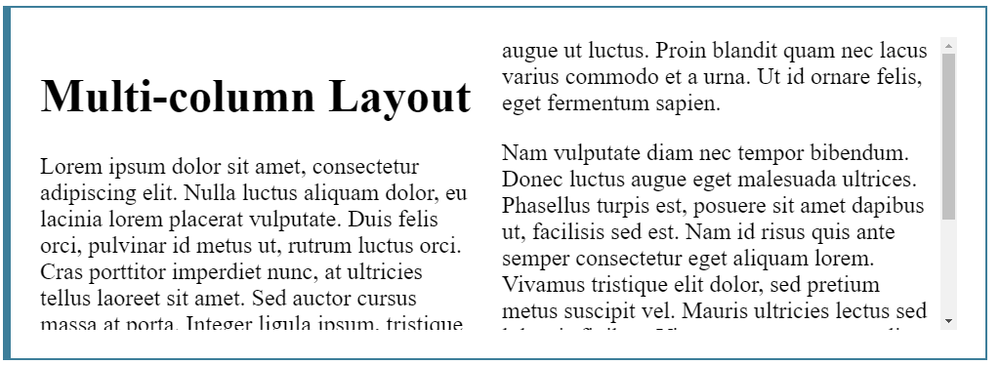
