# Positioning

With CSS we can control where each element sits on a page and it allows us to create attractive page layouts. This will involve learning about how designing for a screen can be different to designing for other mediums (such as print).

We will:

* Explore different ways to position elements using normal flow, relative position, absolute position and floats
* Discover how various devices have different screen sizes and resolutions, and how this affects the design process
* Learn the difference between fixed with and liquid layouts, and how they are created

## Key concepts

### Building blocks

CSS treats each HTML element as if it is in its own box. This box will either be a `block-level` box or an `inline` box.

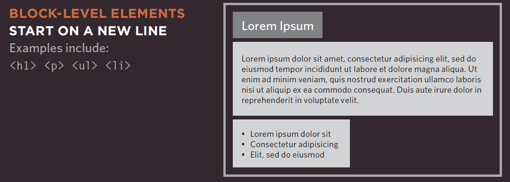

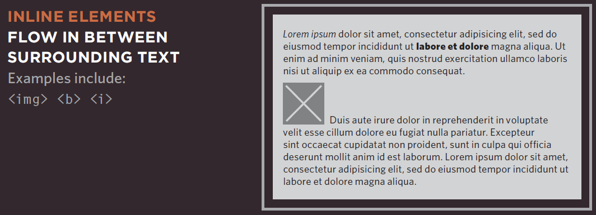

### Container elements

If one `block-level` element sits inside another `block-level` element, then the outer box is know as the **containing** or **parent** element.

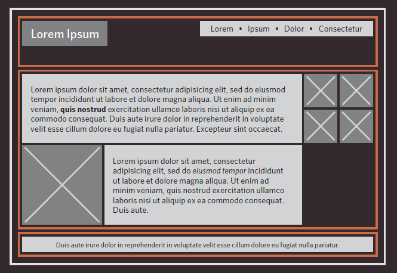

The orange lines in this diagram represent `<div>` elements. The header is in one `<div>` element, the main content of the page is in another, and the footer is in a third. The `<body>` element is the containing element of these three `<div>` elements. The second `<div>` element is the containing element for two paragraphs of Latin text and images.

## Controlling the position

CSS has the following **positioning schemes** that allow you to control the layout of a page:

* Normal flow
* Relative positioning
* Absolute positioning

You can specify the positioning scheme using the `position` property in CSS. You can also float elements using the `float` property.

### Normal flow

Every `block-level` element appears on a new line, causing each item to appear lower down the page than the previous one. Even if you specify the width of the box and there is pace for two elements to sit side-by-side, they will not appear next to each other.

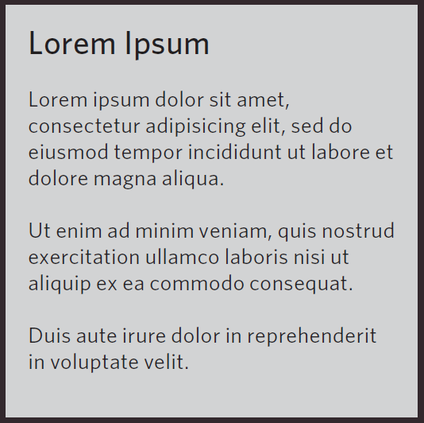

### Relative positioning

This moves an element from the positioning it would be in the normal flow, shifting it to the top, right, bottom or left of where it would have been placed. This does not affect the positioning of surrounding elements. they stay in the position they would be in normal flow.

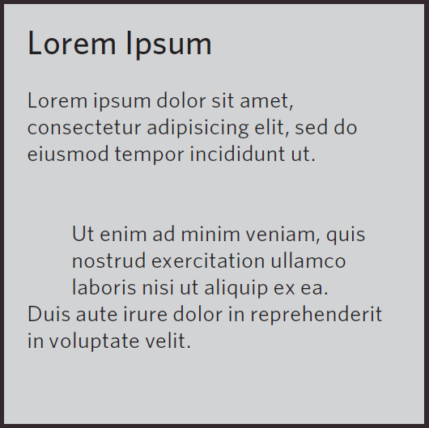

### Absolute positioning

This positions the element in relation to its containing element. It is taken out of normal flow, meaning that it does not affect the position of any surrounding elements. Absolute positioned elements move as users scroll up and down.

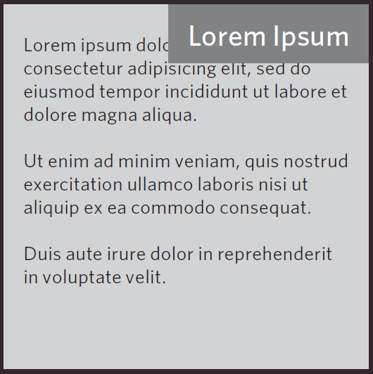

To indicate where a box should be positioned, you may need to use box offset properties to tell the browser how far from the `top` or `bottom` and `left` or `right` it should be placed.

### Fixed positioning

This is a form of absolute positioning that positions the element in relation to the browser window, as apposed to the containing element. Elements with fixed positions do not affect the position of surrounding elements and they do not move when the users scrolls up or down the page

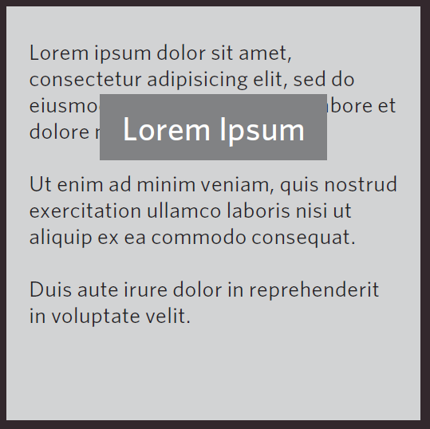

The heading has been placed in the center of the page and 25% from the top of the screen.

When you move any element from normal flow, boxes can overlap. The `z-index` property allows you to control which box appears on top.

### Floating elements

Floating an element allows you to take that element out of normal flow and position it to the far left or right of a containing box. The floated element becomes the a block-level element around which other elements can flow.

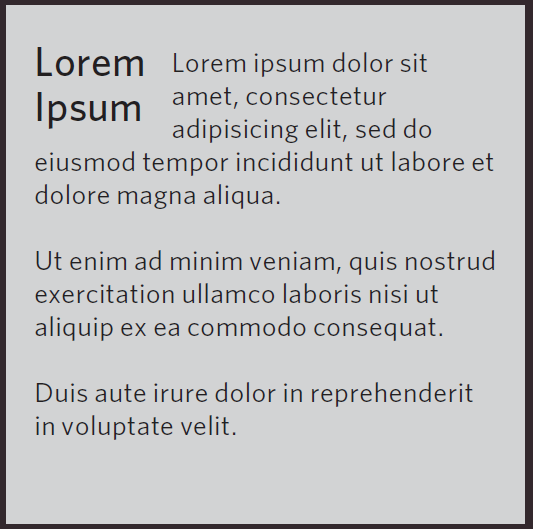

The heading has been floated to the left, allowing paragraphs of text to flow around it.

## Normal flow `position:static`

In normal flow, each block-level element sits on top of the next one.  It is the default way in which browsers treat HTML elements. The CSS property for this behavior is `position: static;`

```html
<body>
  <h1>The Evolution of the Bicycle</h1>
  <p>In 1817 Baron von Drais invented a walking
    machine that would help him get around the
    royal gardens faster...</p>
</body>
```

```css
body {
  width: 750px;
  font-family: Arial, Verdana, sans-serif;
  color: #665544;
}
h1 {
  background-color: #efefef;
  padding: 10px;
}
p {
  width: 450px;
}
```

In this example, paragraphs are restricted to 450px. These elements are in normal flow and start on a new line even if they do not take up the full width of the browser window.

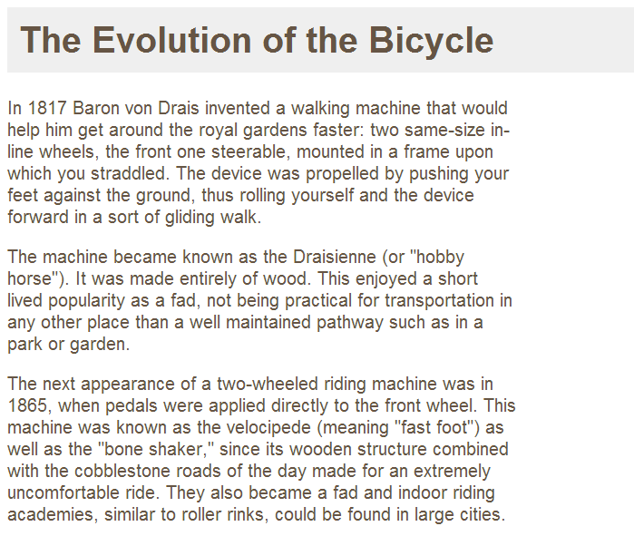

## Relative positioning `position:relative`

**Relative** positioning moves an element in relation to where it would have been in normal flow. You can use the offset properties (`top` or `bottom` and `left` or `right`) to indicate how far to move the element.
  
```html
<body>
  <h1>The Evolution of the Bicycle</h1>
  <p>In 1817 Baron von Drais invented a
    walking machine that would help him get
    around the royal gardens faster...</p>
</body>
```

```css
p.example {
  position: relative;
  top: 10px;
  left: 100px;
}
```

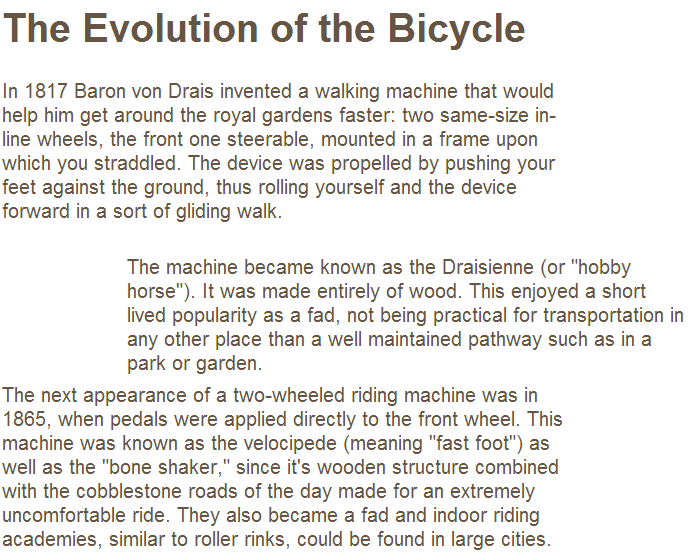

## Absolute positioning `position:absolute`

When the `position` property is given an value of `absolute`, the box is taken out of normal flow an no longer affects the position of other elements on the page. The box offset properties (`top` or `bottom` and `left` or `right`) specify where the element should appear in relation to its containing element.

```html
<body>
  <h1>The Evolution of the Bicycle</h1>
  <p>In 1817 Baron von Drais invented a walking
    machine that would help him get around the
    royal gardens faster...</p>
</body>
```

```css
h1 {
  position: absolute;
  top: 0px;
  left: 500px;
  width: 250px;
}
p {
  width: 450px;
}
```

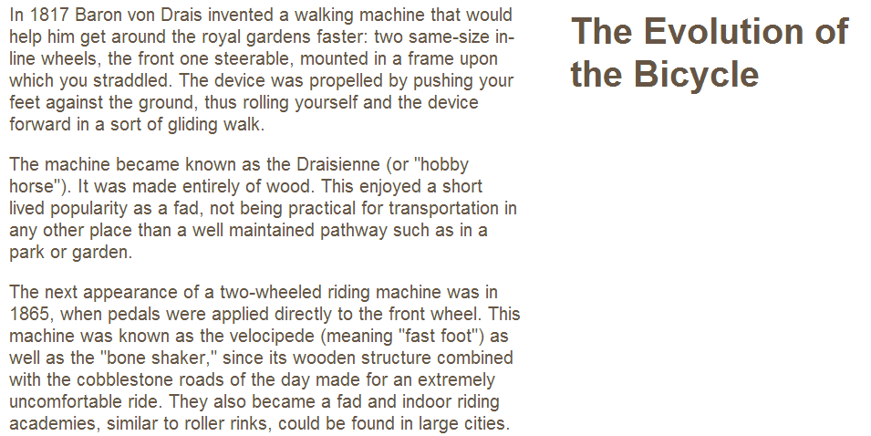

## Fixed positioning `position:fixed`

Fixed position is a type of absolute positioning that requires the `position` property to have a value of `fixed`. It positions the element in relation to the *browser window*. Therefore, when a user scrolls down the page, it stays in the exact same place
To control where the fixed position box appears in relation to the browser window, the box offset properties (`top` or `bottom` and `left` or `right`) are used.

```html
<body>
  <h1>The Evolution of the Bicycle</h1>
  <p class="example">In 1817 Baron von Drais
    invented a walking machine that would help him
    get around the royal gardens faster...</p>
</body>
```

```css
h1 {
  position: fixed;
  top: 0px;
  left: 50px;
  padding: 10px;
  margin: 0px;
  width: 100%;
  background-color: #efefef;
}
p.example {
  margin-top: 100px;
}
```

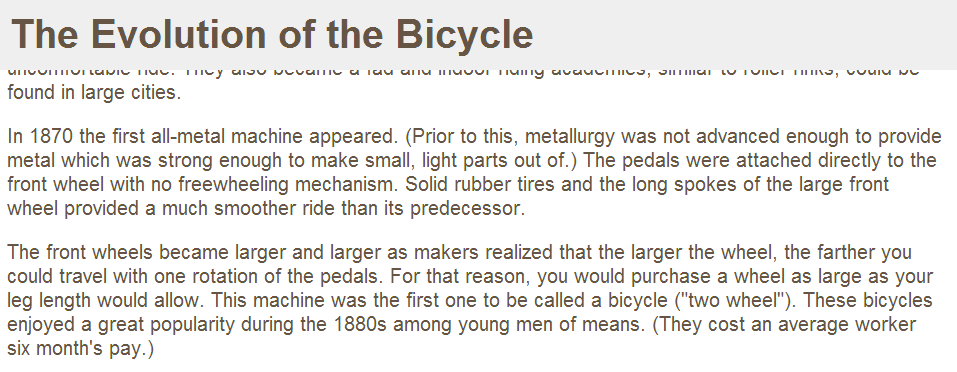

## Overlapping elements

When you use relative, fixed or absolute positioning, boxes can overlap. If boxes overlap, the elements appear later in the HTML code sit on top of those that are earlier in the page. You can control which element should sit on top with the `z-index` property, which value is a number. The higher the `z-index` number, the closer that element is to the front.


```css
h1 {
  position: fixed;
  top: 0px;
  left: 0px;
  margin: 0px;
  padding: 10px;
  width: 100%;
  background-color: #efefef;
  z-index: 10;
}
p {
  position: relative;
  top: 70px;
  left: 70px;
}
```


<!-- markdownlint-disable no-duplicate-header -->
## Floating elements

The `float` property allows you to take an element in normal flow and place it as far to the `left` of `right` of the containing element as possible.

Anything else that sits inside the containing element will flow around the element that is floated.

When using the `float` property, you should use the width property to indicate how wide the floated element should be. If you do not, results can be inconsistent but the box is likely to take up the full width of the containing element.

```html
<h1>The Evolution of the Bicycle</h1>
<blockquote>"Life is like riding a bicycle.
  To keep your balance you must keep moving." -
  Albert Einstein</blockquote>
<p>In 1817 Baron von Drais invented a walking
  machine that would help him get around the royal
  gardens faster: two same-size in-line wheels, the
  front one steerable, mounted in a frame ... </p>
```

```css
blockquote {
  float: right;
  width: 275px;
  font-size: 130%;
  font-style: italic;
  font-family: Georgia, Times, serif;
  margin: 0px 0px 10px 10px;
  padding: 10px;
  border-top: 1px solid #665544;
  border-bottom: 1px solid #665544;
}
```

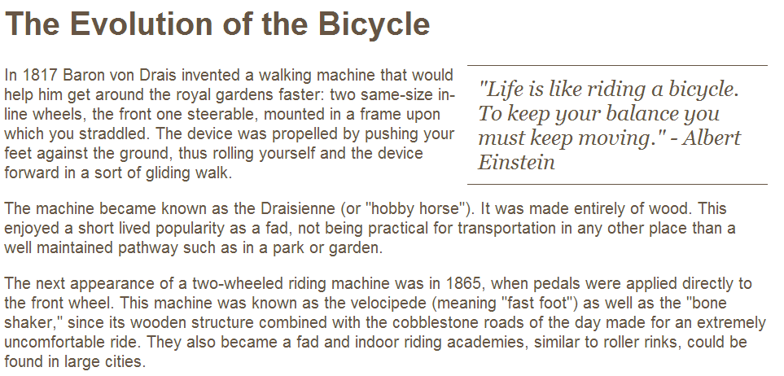

### Using float to place elements side-by-side

A lot of layouts place boxed next to each other, the `float` property is commonly used to achieve this. When elements are floated, the height of the boxes can affect where the following element sit.

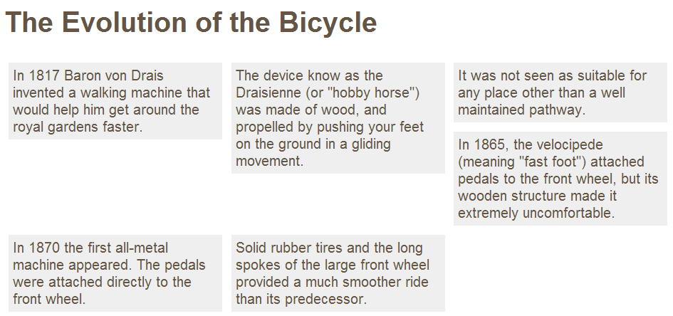

The fourth paragraph does not go across to the left hand edge of the page as one might expect. Rather it sits right under the third paragraph. This is because the second paragraph is in its way to go any further to the left. Setting the height of the paragraphs to be the same height as the tallest one would solve this issue, but is rarely suited to the real world designs.

```html
<body>
  <h1>The Evolution of the Bicycle</h1>
  <p>In 1817 Baron von Drais invented a walking
    machine that would help him get around...</p>
</body>
```

```css
body {
  width: 750px;
  font-family: Arial, Verdana, sans-serif;
  color: #665544;
}
p {
  width: 230px;
  float: left;
  margin: 5px;
  padding: 5px;
  background-color: #efefef;
}
```

### Clearing floats: `clear`

The `clear` property allows you to say that no element within the same containing element should touch the left or right-hand sides of a box. It can take the following values:

* **left**: The left-hand side of the box should not touch any other elements appearing in the same containing element
* **right**: The right-hand side of the box will not touch elements appearing in the same containing element
* **both**: Neither the left of right-hand sides of the box will touch elements appearing in the same containing element
* **none**: Elements can touch either side

```html
<p class="clear">In 1865, the velocipede (meaning
  "fast foot") attached pedals to the front wheel,
  but its wooden structure made it extremely
  uncomfortable.</p>
```

```css
body {
  width: 750px;
  font-family: Arial, Verdana, sans-serif;
  color: #665544;
}
p {
  width: 230px;
  float: left;
  margin: 5px;
  padding: 5px;
  background-color: #efefef;
}
.clear {
  clear: left;
}
```

### Parents of floated elements: problem

If a containing element only contains floated elements, some browsers will treat it as if it is zero pixels tall.

As you can see in the example, the one pixel border assigned to the containing element has collapsed, so the box looks like a two pixel line.

```html
<body>
  <h1>The Evolution of the Bicycle</h1>
  <div>
    <p>In 1817 Baron von Drais invented a walking
      machine that would help him get around the
      royal gardens faster...</p>
  </div>
</body>
```

```css
div {
  border: 1px solid #665544;
}
```

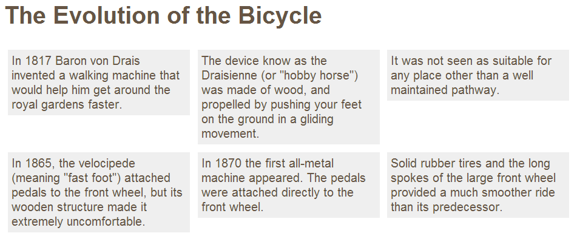

### Parents of floated elements: solution

A pure CSS-based solution, without the need to add an extra HTML element, is to add two CSS rules tot the containing element.

* The `overflow` property is given a value `auto`
* The `width` property is set to `100%`

```css
div {
  border: 1px solid #665544;
  overflow: auto;
  width: 100%;
}
```

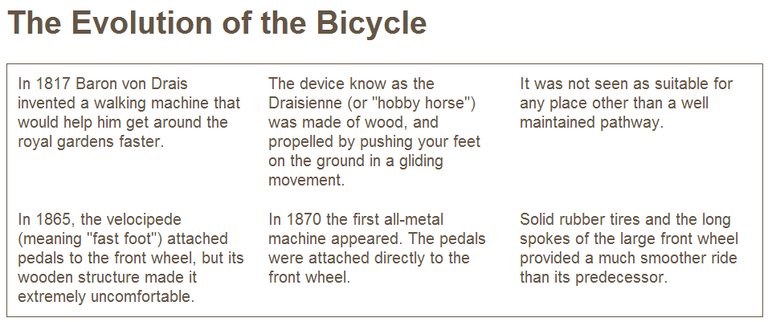

## Creating multi-column layouts with floats

Many websites use multiple columns in their design. This is achieved by using a `<div>` or an equivalent element to represent each column. The following CSS properties are used to position the columns next to each other:

* **width**: This sets the width of the column
* **float**: This positions the columns next to each other
* **margin**: Creates a gap between the columns

```html
<h1>The Evolution of the Bicycle</h1>
<div class="column1of2">
    <h3>The First Bicycle</h3>
    <p>In 1817 Baron von Drais invented a walking
        machine that would help him get around the
        royal gardens faster: two same-size ...</p>
    </div>
    <div class="column2of2">
    <h3>Bicycle Timeline</h3>
    ...
</div>
```

```css
.column1of2 {
   float: left;
   width: 620px;
   margin: 10px;
}
.column2of2 {
   float: left;
   width: 300px;
   margin: 10px;
}
```

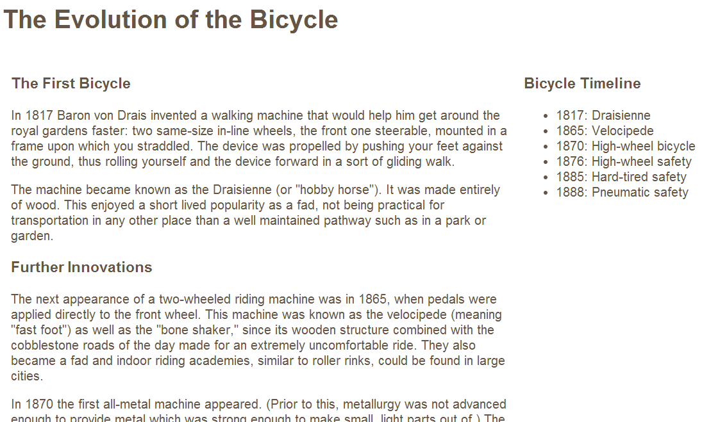

Similar, a three column layout could be created by floating three `<div>` elements next to each other.

```html
<h1>The Evolution of the Bicycle</h1>
<div class="column1of3">
   <h3>The First Bicycle</h3> ...
</div>
<div class="column2of3">
   <h3>Further Innovations</h3> ...
</div>
<div class="column3of3">
   <h3>Bicycle Timeline</h3> ...
</div>
```

```css
.column1of3,
.column2of3,
.column3of3 {
   width: 300px;
   float: left;
   margin: 10px;
}
```

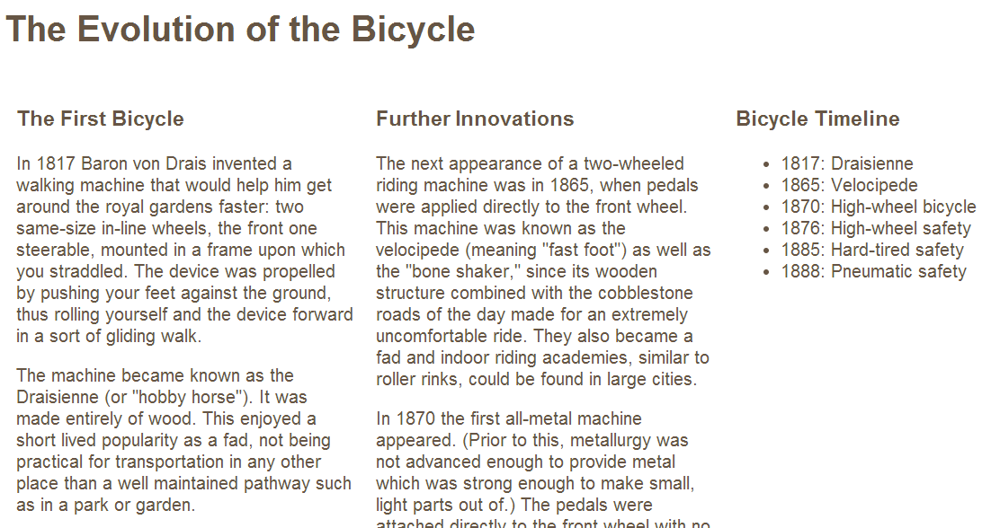

## Multiple style sheets: `@import`

Some web page authors split their CSS style rules into separate style sheets. (for better maintainability). Some take an even more modular approach to style sheets, creating separate style sheets to control typography, layout, forms, tables, or even subsections of a site.

There are two ways to add multiple style sheets to a page.

* `Link` each style sheet in HTML
* Use `@import` to import other style sheets

### `@import`

```css
@import url("tables.css");
@import url("typography.css");
body {
  color: #666666;
  background-color: #f8f8f8;
  text-align: center;
}
#page {
  width: 600px;
  text-align: left;
  margin-left: auto;
  margin-right: auto;
  border: 1px solid #d6d6d6;
  padding: 20px;
}
h3 {
  color: #547ca0;
}
```

```html
<!DOCTYPE html>
<html>
  <head>
    <title>Multiple Style Sheets - Import</title>
    <link rel="stylesheet"
      type="text/css" href="css/styles.css" />
  </head>
  <body>
    <!-- HTML page content here -->
  </body>
</html>
```


### `link`

You can include multiple style sheets providing each style sheet in an `<link>` element inside the `<head>` element. No need for `@import` rules inside the style sheets. If two rules apply to the same element then the rules that appear later in a document will take precedence over previous rules.

```html
<!DOCTYPE html>
<html>
  <head>
    <title>Multiple Style Sheets - Link</title>
    <link rel="stylesheet" type="text/css" href="css/site.css" />
    <link rel="stylesheet" type="text/css" href="css/tables.css" />
    <link rel="stylesheet" type="text/css" href="css/typography.css" />
  </head>
  <body>
    <!-- HTML page content here -->
  </body>
</html>
```


## Summary

* `<div>` elements are often used as containing elements to group together sections of a page
* Browsers display pages in `normal flow` unless you specify `relative`, `absolute` or `fixed` position
* The `float` property moves content to the left or right of the page and can be used to create multi-column layouts.
* You can include multiple CSS files in one page
