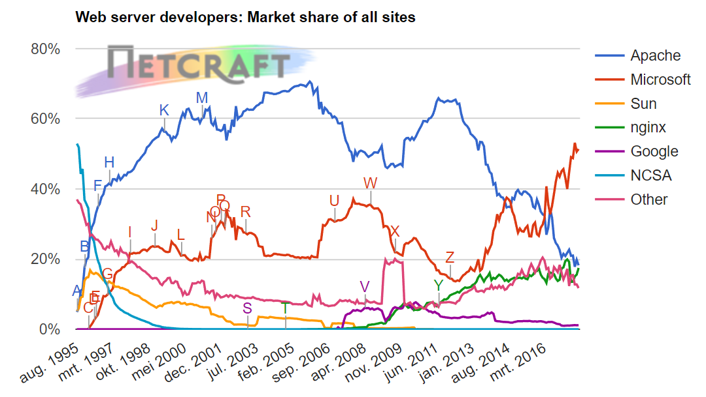

# Webservers

Processes requests via HTTP, creates responses. The primary function of a web server is to store, process and deliver web pages to clients.

Many generic web servers also support server-side scripting PHP, ASP \(C\#\), JSP \(Java\), Ruby, Node.js,… These programming languages are used to generate HTML documents dynamically \("on-the-fly"\) as opposed to returning static documents.

* Internet Information Services – IIS
  * Microsoft
  * Windows server
* Apache
  * Available on various platforms XAMP
* Ngnix
  * Newest, fastest
* Lighttpd
  * lightweight, embedded
  * Microcontrollers

HTTP Servers market share:

Source: [https://news.netcraft.com/archives/2017/](https://news.netcraft.com/archives/2017/)
