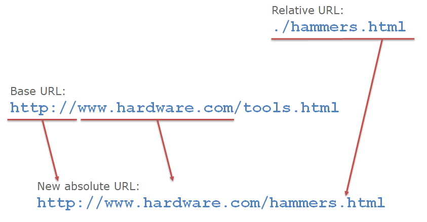

# Uniform Resource Locator - URL

Uniform Resource Locators or short URLs are standardized names for internet resources. URLs point to pieces of information and tells two things about that piece of information.

* Telling where they are located
* How to interact with them

In the example above 3 distinct parts can be recognized:

* **Scheme**: it tells the client how to access the resource. The URL says to use the HTTP protocol
* **Host**: is the server location, telling where the resource is hosted, in this case the host or server is called `www.example.com`
* **Resource path**: it tells what local resource on the server is being requested. In this case we are interested in the `/books/downloads.html` document.

## URL scheme for HTTP

Urls can exist out of more parts. This is demonstrated by the URL syntax for the http scheme:

* **Host**: the server to request the resource from
* **Port**: on what TCP port to connect to on the host \(server\). This defaults to port `80` if omitted
* **Path**: where on the server the resource is located
* **Query**: queries can be used to _filter_ down the resource. The query is prefixed by the `?` character.
* **Fragment**: can be used to _identify a single piece_ within the resource. The fragment is prefixed by the `#` character

### Absolute vs relative

Web clients \(browser\) understand a few URL shortcuts

Relative URLs are a shorthand for specifying a resource within a resource URL’s can be absolute or relative

* An **absolute URL** contains all the information to access a resource
* A **relative URL** is incomplete. To get all the information it must interpret it relative to another URL, called the _base_

Relative URLs are relative to the document in which it is found

